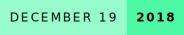
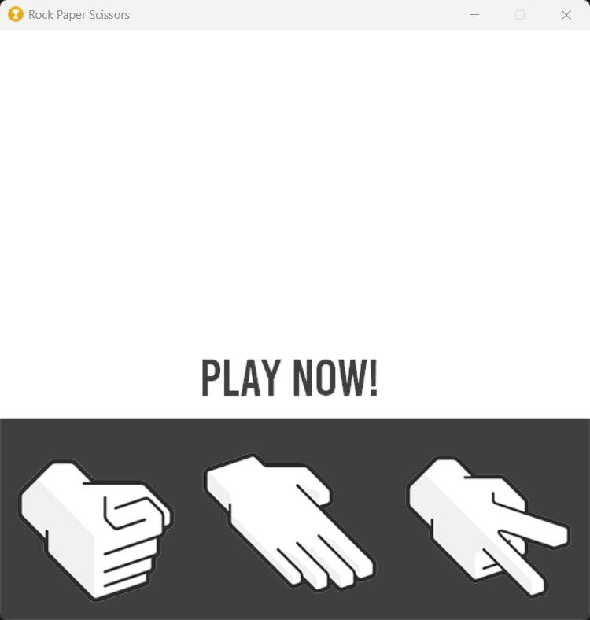
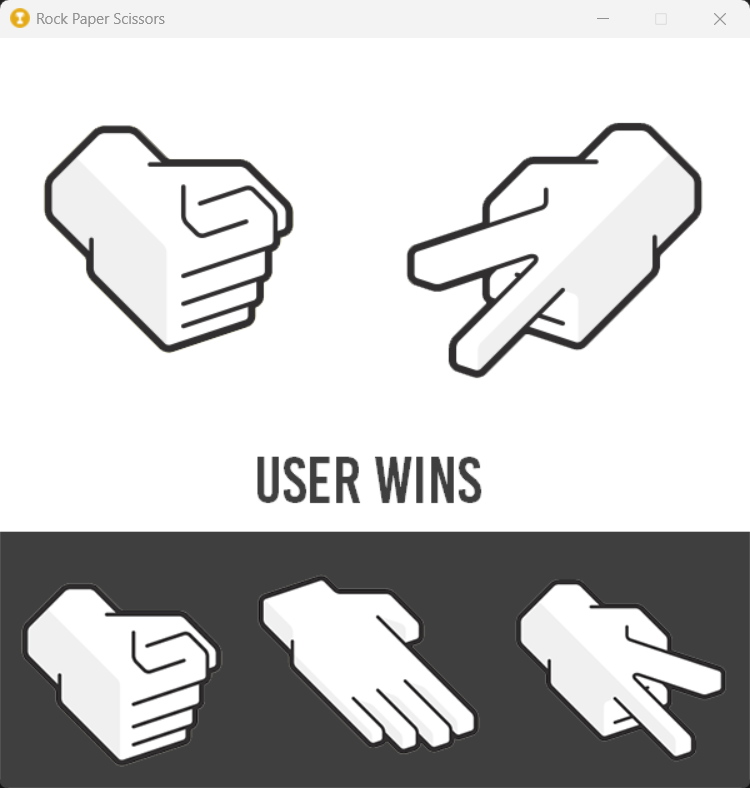

# Rock, Paper, and Scissors
    

A simple game of rock, paper, and scissors made in Python.

### Author's Notes
*This is a 1-day project that took one afternoon when I was in highschool. It's a very simple game of rock, paper, and scissors.*

## Screenshots

    <h3>Main Screen</h3>
    
    <h3>User Wins</h3>
    

## How to Run

You can download the source code and **install all the fonts in the `fonts/` folder**. Then, run using `py .\rock-paper-scissors.py`.

## Feedback

If you have any feedback/comment/request, please reach out to [aquino.ylt@gmail.com](mailto:aquino.ylt@gmail.com).